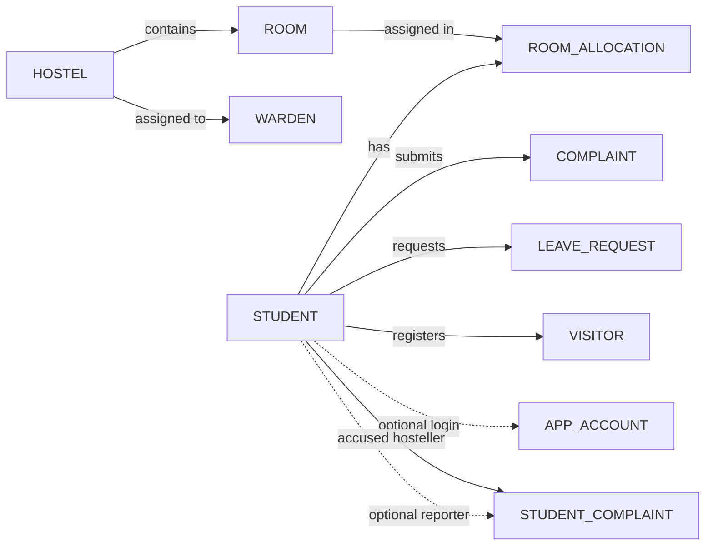

# Hostel Management System — DBMS Project Notes

## Project overview

The Hostel Management System stores hostel, room, student, room-allocation, maintenance-complaint, complaint-against-hosteller, leave, visitor, and application-account data in Oracle Database Free. An Express application uses the `oracledb` driver to read and update the database; browser pages provide the admin, warden, and student interfaces.

The **database is the source of truth**. The pages submit requests to the server, and the server executes SQL against Oracle. Authentication roles restrict which parts of the application a user may access.

## ER diagram (logical relationships)



`ROOM_ALLOCATION` resolves the many-to-many relationship between students and rooms over time. A student may have historical allocation rows, while each allocation refers to one student and one room. `STUDENT_COMPLAINT` has two different relationships to `STUDENT`: the accused hosteller is required; the reporting student is optional so staff-entered reports are supported. Admin and warden application accounts do not link to a student row. The exported Oracle DDL confirms that each warden row belongs to a hostel.

## Main entities

| Table | Purpose | Key relationship |
|---|---|---|
| `HOSTEL` | Hostel blocks and their identifying details | Parent of `ROOM` |
| `WARDEN` | Warden name and contact details | Belongs to `HOSTEL` |
| `ROOM` | Room number, block, type, capacity, and floor | Belongs to `HOSTEL`; referenced by `ROOM_ALLOCATION` |
| `STUDENT` | Registration, contact, department, and year details | Parent of allocations, issues, leave, visitors, and reports |
| `ROOM_ALLOCATION` | Student room placement and its dates/status | Links `STUDENT` and `ROOM` |
| `COMPLAINT` | Hostel maintenance or facility issues reported by students | References the student who filed the issue |
| `STUDENT_COMPLAINT` | A report made against a hosteller, separate from maintenance issues | References accused student and optionally reporting student |
| `LEAVE_REQUEST` | Student leave dates, reason, and review status | References `STUDENT` |
| `VISITOR` | Visitor details and visit schedule | References `STUDENT` |
| `APP_ACCOUNT` | Hashed sign-in credentials and role | Student accounts optionally/uniquely link to `STUDENT`; admin/warden links are null |

### Data dictionary (main columns)

| Table | Important columns |
|---|---|
| `HOSTEL` | `hostel_id` (PK), `hostel_name`, `hostel_type`, `capacity`, `location` |
| `WARDEN` | `warden_id` (PK), `warden_name`, `phone`, `email`, `hostel_id` (FK) |
| `ROOM` | `room_id` (PK), `hostel_id` (FK), `room_number`, `room_type`, `capacity`, `floor_number` |
| `STUDENT` | `student_id` (PK), `registration_no`, `student_name`, `gender`, `date_of_birth`, `phone`, `email`, `department`, `year_of_study`, `address` |
| `ROOM_ALLOCATION` | `allocation_id` (PK), `student_id` (FK), `room_id` (FK), `allocation_date`, `vacate_date`, `status` |
| `COMPLAINT` | `complaint_id` (PK), `student_id` (FK), `complaint_type`, `description`, `complaint_date`, `status`, `resolution`, `resolved_date` |
| `STUDENT_COMPLAINT` | `complaint_id` (PK), `accused_student_id` (FK), `reporter_student_id` (optional FK), `complaint_type`, `description`, `complaint_date`, `reported_by`, `status`, `resolution`, `resolved_date` |
| `LEAVE_REQUEST` | `leave_id` (PK), `student_id` (FK), `from_date`, `to_date`, `reason`, `status`, `applied_date`, `remarks` |
| `VISITOR` | `visitor_id` (PK), `student_id` (FK), `visitor_name`, `relationship`, `phone`, `visit_date`, `in_time`, `out_time`, `purpose` |
| `APP_ACCOUNT` | `account_id` (PK), `username`, `password_salt`, `password_hash`, `role`, `is_active`, optional `student_id` (FK), `must_change_password`, `created_at` |

The application uses `AC` and `NON-AC` room types and room capacities from 1 through 4. Student-submitted complaints against hostellers start as `PENDING`; staff can review the report and update its status.

## Relationships and cardinality

- One hostel contains many rooms and can have many warden records; each room and warden row belongs to one hostel.
- A student can have multiple room-allocation records over time; each allocation points to one room. This also models students moving rooms and rooms housing different students over time.
- A student can submit many facility complaints, leave requests, and visitor records.
- A student can be the accused person in many reports and can optionally submit many reports against other students.
- A student has at most one student login account. Admin and warden accounts are not linked to a student record.

## Normalization

The design separates entities that have their own identity and repeated records. Hostel details are stored once in `HOSTEL`; rooms refer to the hostel key instead of repeating block details. Student details are stored once in `STUDENT`; allocations, complaints, leave requests, and visitor rows refer back to the student key. Room occupancy history is stored in `ROOM_ALLOCATION` rather than as a changing list inside a student or room row.

This structure supports first normal form by storing individual values in columns, and it is intended to support second and third normal form by keeping attributes with the entity they describe and referring to other entities by keys. Confirm the final normal-form claims against the actual Oracle DDL and functional dependencies before submission.

## Integrity and validation

- Primary keys identify every entity/record.
- Foreign keys connect rooms and wardens to hostels; allocations to students and rooms; facility complaints, leave requests, and visitors to students; and accounts and student reports to their related students.
- Unique constraints protect hostel names, room numbers within each hostel, student registration numbers, student phone/email, warden phone/email, account usernames, and one-to-one student-account links.
- Check constraints restrict hostel type/capacity, room type/capacity/floor, student gender/year, allocation status/dates, complaint categories/status, leave status/dates, account role/active/password-change flags, and student-report status.
- The application validates input lengths, dates, categories, and statuses before sending bound SQL values to Oracle.
- Room allocation checks room capacity and active allocations before placing a student.
- Application passwords are stored as salted hashes, not plaintext.

For the report, copy the exact constraint names and definitions from the generated Oracle DDL rather than relying only on this summary.

## Example SQL queries for the demonstration

### Students and their active room

```sql
SELECT s.registration_no,
       s.student_name,
       h.hostel_name,
       r.room_number,
       a.allocation_date
FROM student s
JOIN room_allocation a ON a.student_id = s.student_id
JOIN room r ON r.room_id = a.room_id
JOIN hostel h ON h.hostel_id = r.hostel_id
WHERE a.status = 'ACTIVE'
ORDER BY h.hostel_name, r.room_number, s.student_name;
```

### Current occupancy by room

```sql
SELECT h.hostel_name,
       r.room_number,
       r.capacity,
       COUNT(a.allocation_id) AS occupied_beds,
       r.capacity - COUNT(a.allocation_id) AS available_beds
FROM room r
JOIN hostel h ON h.hostel_id = r.hostel_id
LEFT JOIN room_allocation a
       ON a.room_id = r.room_id
      AND a.status = 'ACTIVE'
GROUP BY h.hostel_name, r.room_number, r.capacity
ORDER BY h.hostel_name, r.room_number;
```

### Pending leave requests

```sql
SELECT s.registration_no,
       s.student_name,
       l.from_date,
       l.to_date,
       l.reason
FROM leave_request l
JOIN student s ON s.student_id = l.student_id
WHERE l.status = 'PENDING'
ORDER BY l.applied_date;
```

### Report counts by accused hosteller (dismissed reports excluded)

```sql
SELECT s.registration_no,
       s.student_name,
       COUNT(c.complaint_id) AS reports_counted
FROM student s
LEFT JOIN student_complaint c
       ON c.accused_student_id = s.student_id
      AND c.status <> 'DISMISSED'
GROUP BY s.registration_no, s.student_name
ORDER BY reports_counted DESC, s.student_name;
```

## Recreating the database

The exact table definitions were exported from Oracle into [`../sql/hostel_schema_export.sql`](../sql/hostel_schema_export.sql). A portable copy without the original `SYSTEM` owner prefix is available at [`../sql/create_hostel_schema.sql`](../sql/create_hostel_schema.sql). Run the creation script only in a fresh/empty schema; it creates tables and constraints but does not insert records. For a demo database, run `create_hostel_schema.sql`, then [`../sql/seed_demo_hostels.sql`](../sql/seed_demo_hostels.sql), then [`../sql/reset_students_realistic.sql`](../sql/reset_students_realistic.sql). The last script replaces student-linked data with 100 synthetic students and room allocations, so run it only in the fresh demo schema.

Do not put real passwords or production student contact information in the submission. Use synthetic demo rows and create fresh demo accounts for a presentation.

## Demonstration flow

1. Sign in as admin and show the relational data pages.
2. Open room allocations and show the student/room join and current capacity.
3. Sign in as a student and submit a hostel issue, leave request, visitor entry, and (if appropriate for the demo) report against another hosteller.
4. Sign in as warden/admin and review the pending requests and reports.
5. Run the example SQL queries in SQL*Plus and explain the primary/foreign-key joins.

## Setup notes to finish before submission

- Include the exported DDL and the ER diagram with the submission.
- If demonstrating a clean setup, run the three scripts in the order above in a separate empty schema.
- Include only a small synthetic data set in the report; do not submit real credentials.
- Confirm that `FEE_PAYMENT` has been dropped if the project is being submitted without the fee feature.
